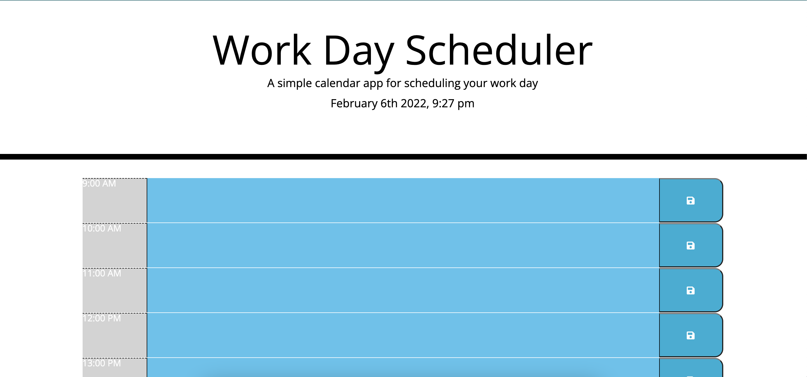

# work-day-scheduler

This application allows you to add notes within certain time blocks in your work day.
type in the time block you want and save the note.
the colors of the time block with display different colors based on past presetn and future hours.

Check it out here
https://davidebcurtis.github.io/work-day-scheduler/
